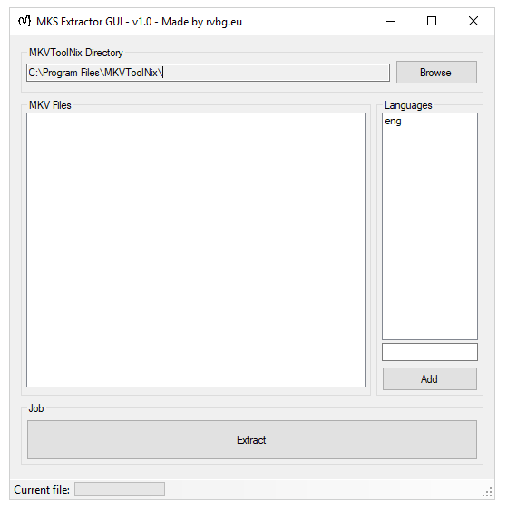

# MKS Extractor GUI

Extract Matroska subtitle files (MKS) from MKV files with a GUI. Wrapper for MKVToolNix. This tool is intended to use with **Windows**.

[Download](https://github.com/rvbg/mks-extractor-gui/releases)

## Instructions
 1. Select your MKVToolNix diretory.
 2. Drag&Drop your MKV files into the "MKV Files" box.
 3. Add your [ISO 639-2 language code](https://en.wikipedia.org/wiki/List_of_ISO_639-2_codes) on the right hand side.
 4. Start the job.

## Features

 - ✅ implemented
 - ⬜ not implemented

| Status | Feature |
|--|--|
| ✅ | Extract from multiple MKV files. |
| ✅ | Select multiple languages. |
| ✅ | Select own MKVToolNix directory. |
| ✅ | Pause the running queue. |
| ⬜ | Save the configuration for the next time. |
| ⬜ | Language drop down menu.
| ⬜ | Select output directory. |
| ⬜ | Stop running process. |